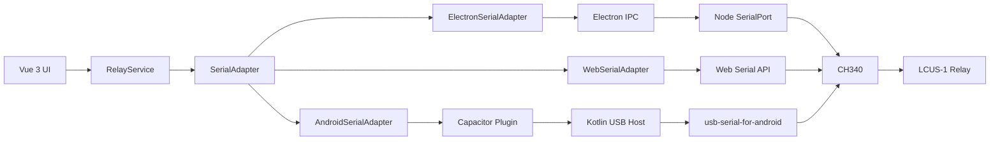

# USB Relay Android

一个面向真实 USB 串口继电器的跨平台本地控制工具，支持 **Android、Windows Electron 和浏览器 Web Serial**。

项目复用同一套 Vue 3 界面、`RelayService`、串口抽象层和 LCUS-1 HEX 协议，只针对不同平台替换底层串口实现。Android 版通过 Capacitor、Kotlin、Android USB Host API 和 `usb-serial-for-android` 直接控制本机 USB 设备，不依赖 Node.js、Electron 或远程后端。

[](https://vuejs.org/)
[](https://www.typescriptlang.org/)
[](https://capacitorjs.com/)
[](https://developer.android.com/)
[](LICENSE)

> [!IMPORTANT]
> Windows Electron 版已使用 CH340 + LCUS-1 完成真实硬件控制验证。Android 版已完成 Kotlin 编译、Gradle 构建和 APK 验证，但尚未在真实 Android USB OTG 硬件上执行控制测试。

## 项目定位

本项目用于在手机、平板或电脑上直接控制 USB 串口继电器：

```text
Android / Windows / Browser
              |
        USB Serial / USB OTG
              |
          CH340 UART
              |
           LCUS-1
              |
          Relay Load
```

应用不会通过云端、局域网或远程服务器间接控制继电器。所有串口操作都在当前设备本机完成。

## 功能特性

- Android USB Host 原生设备扫描和串口枚举
- Android USB 权限申请、拒绝和超时处理
- CH340、CP210x、FTDI、Prolific、CDC ACM 等常见 USB 串口驱动支持
- USB 拔出自动关闭串口并同步前端状态
- Android 自动重连和重新授权流程
- 统一复用 Vue 3 UI、`RelayService` 和串口配置
- Windows Electron 通过 Node SerialPort 访问 COM 端口
- 浏览器通过 Chromium Web Serial API 访问串口
- 支持自定义 ON/OFF HEX 指令
- 支持波特率、数据位、停止位、校验位和流控设置
- 操作日志、中文错误提示和旧配置自动迁移
- Vitest 单元测试和 TypeScript 严格类型检查

## 平台支持

| 平台 | 底层实现 | 状态 |
| --- | --- | --- |
| Android | Capacitor + Kotlin + Android USB Host API | 构建通过，真实 OTG 硬件测试待执行 |
| Windows | Electron + Node SerialPort | CH340 + LCUS-1 已实机验证 |
| Chrome / Edge | Web Serial API | 已实现，需要安全上下文和设备授权 |

Android 最低版本为 **Android 7.0（API 24）**。目标设备必须支持 USB Host 或 USB OTG。

## 下载

正式构建版本通过 [GitHub Releases](https://github.com/AbsoluteZero001/USB-Relay-Android/releases) 提供。

Android 用户下载：

```text
USB-Relay-Android-vX.Y.Z.apk
```

APK 不通过应用商店分发时，Android 可能提示需要允许当前文件管理器或浏览器“安装未知应用”。请只安装来源明确且校验值匹配的 APK。

## Android 发布状态

| 检查项 | 状态 |
| --- | --- |
| Kotlin 编译 | ✅ 已验证 |
| Gradle Debug 构建 | ✅ 已验证 |
| Gradle Release 构建 | ✅ 已验证 |
| Release APK 签名 | ✅ 已验证 |
| HONOR HEY-W09 ADB 真机连接 | ✅ 已验证 |
| Release APK 真机安装 | ✅ 已验证 |
| Android App 真机启动 | ✅ 已验证 |
| Android USB OTG + CH340 | ⏳ 待验证 |
| LCUS-1 Relay ON/OFF | ⏳ 待验证 |

荣耀平板 8，型号 **HONOR HEY-W09**，已能够被 Android Studio / ADB 识别。ADB 识别不代表 APK 已安装，也不代表 USB OTG 和继电器控制已经通过测试。

## 版本管理

`frontend/package.json` 的 `version` 是项目版本源。

Android 构建会自动读取该版本，并计算：

```text
versionName = package.json version
versionCode = major * 10000 + minor * 100 + patch
```

当前版本：

| 项目 | 值 |
| --- | --- |
| `package.json` version | `0.4.0` |
| Android `versionName` | `0.4.0` |
| Android `versionCode` | `400` |

版本升级示例：

```text
0.4.1 -> 401
0.5.0 -> 500
1.0.0 -> 10000
```

## 已验证硬件

| 项目 | 值 |
| --- | --- |
| USB 转串口芯片 | CH340 |
| VID | `0x1A86` |
| PID | `0x7523` |
| 继电器 | LCUS-1 单路 USB Relay |
| 驱动 | `usb-serial-for-android` / Node SerialPort / Web Serial |

## 已验证指令

| 操作 | HEX 指令 | Windows 验证结果 |
| --- | --- | --- |
| Relay 1 ON | `A0 01 01 A2` | 继电器吸合 |
| Relay 1 OFF | `A0 01 00 A1` | 继电器释放 |

LCUS-1 当前没有经过验证的状态回读协议。界面中的 `ON` / `OFF` 表示软件最近一次成功发送的控制命令，不代表已经从硬件读取到真实触点状态。

## 系统架构



关键设计：

- `RelayService` 不依赖任何平台 API。
- Windows、Web 和 Android 共用同一套继电器协议。
- Electron Node/SerialPort 代码与 Android WebView 完全隔离。
- Android 只向 TypeScript 暴露受限的 Capacitor 插件接口。
- 串口写数据使用 Base64 跨原生桥传输，避免协议字节被字符串编码破坏。

## Android 使用

### 前置条件

- 支持 USB OTG / USB Host 的 Android 手机或平板
- Android 7.0 或更高版本
- USB OTG 转接线
- CH340 + LCUS-1 USB 继电器
- 如果发布方提供 APK，直接安装即可；自行构建时需要 JDK 21 和 Android SDK 36

### 操作步骤

1. 使用 USB OTG 将 CH340 继电器连接到 Android 设备。
2. 打开 `USB Relay`。
3. 等待应用识别 `1A86:7523` 设备。
4. 在 Android 系统弹窗中允许 USB 设备访问。
5. 点击“连接”。
6. 使用界面开关发送 ON 或 OFF。
7. 不使用继电器时点击“断开”。

如果之前拒绝过权限，点击“扫描 USB”重新发起授权。Android 系统可能记住同一设备的授权状态。

## Windows 与浏览器

### Windows Electron

Windows 版通过 Electron 主进程中的 Node SerialPort 访问 COM 端口，适合长期桌面使用和直接安装部署。

系统要求：

- Windows 10/11 x64
- CH340 驱动
- 未被 SSCOM、PuTTY 或其他串口工具占用的 COM 端口

### 浏览器

浏览器版要求：

- Chrome 或 Edge 89+
- 通过 `https://`、`http://localhost` 或 `127.0.0.1` 访问
- 首次使用时手动选择并授权串口设备

Firefox 和 Safari 当前不支持 Web Serial API。

## 开发环境

推荐环境：

- Node.js 20+
- npm 10+
- JDK 21
- Android SDK Platform 36
- Android SDK Build Tools 35 或更高版本
- Android Studio（可选，用于原生调试）

安装依赖：

```bash
git clone https://github.com/AbsoluteZero001/USB-Relay-Android.git
cd USB-Relay-Android/frontend
npm ci
```

`postinstall` 会调用 `electron-builder install-app-deps`，为当前 Electron 版本重建原生依赖。

启动 Electron/Vite 开发环境：

```bash
npm run dev
```

浏览器联调地址：

```text
http://localhost:5173
```

## 构建

### Web 与 Electron

```bash
cd frontend
npm run build
```

构建 Windows 安装包：

```bash
npm run dist
```

输出目录：

```text
frontend/release/
```

### Android Debug APK

```bash
cd frontend
npm run build
npx cap sync android

cd android
./gradlew assembleDebug
```

Windows PowerShell：

```powershell
cd frontend
npm run build
npx cap sync android

cd android
.\gradlew.bat assembleDebug
```

也可以直接执行：

```bash
npm run android:build
```

Debug APK 输出路径：

```text
frontend/android/app/build/outputs/apk/debug/app-debug.apk
```

### Android Release APK

Release 签名信息从 `frontend/android/keystore.properties` 读取。该文件和真实 keystore 不得提交到 Git。

创建本地配置：

```powershell
Copy-Item frontend\android\keystore.properties.example frontend\android\keystore.properties
```

填写以下内容：

```properties
storeFile=/path/to/your/release.keystore
storePassword=YOUR_STORE_PASSWORD
keyAlias=YOUR_KEY_ALIAS
keyPassword=YOUR_KEY_PASSWORD
```

构建签名 Release APK：

```powershell
cd frontend
npm run android:release
```

签名 APK 输出路径：

```text
frontend/android/app/build/outputs/apk/release/app-release.apk
```

如果没有 `keystore.properties`，Gradle 会生成 `app-release-unsigned.apk`。未签名包不能作为正式 GitHub Release 发布。

使用 Android Studio 打开原生工程：

```bash
npx cap open android
```

## 常用命令

| 命令 | 说明 |
| --- | --- |
| `npm run dev` | 启动 Vite 和 Electron 开发环境 |
| `npm run typecheck` | 运行 TypeScript 类型检查 |
| `npm test` | 运行 Vitest 单元测试 |
| `npm run build` | 构建 Web、Electron main 和 preload |
| `npm run dist` | 构建 Windows EXE 和 ZIP |
| `npm run android:sync` | 构建 Web 并同步 Android 工程 |
| `npm run android:open` | 使用 Android Studio 打开工程 |
| `npm run android:build` | 构建 Android Debug APK |
| `npm run android:release` | 构建 Android Release APK |
| `npm audit` | 检查依赖漏洞 |

## 串口参数

默认参数与已验证的 LCUS-1 配置保持一致：

| 参数 | 默认值 |
| --- | --- |
| 波特率 | `9600` |
| 数据位 | `8` |
| 校验位 | `None` |
| 停止位 | `1` |
| 流控 | `None` |

参数可以在应用设置页面中修改。CH340 通常不支持硬件 RTS/CTS 或软件 XON/XOFF 流控；选择不受支持的参数时，Android 会返回 `INVALID_SERIAL_CONFIG`。

## 项目结构

```text
USB-Relay-Android/
├─ .github/workflows/android-release.yml
├─ LICENSE
├─ README.md
└─ frontend/
   ├─ android/
   │  ├─ keystore.properties.example
   │  └─ app/src/main/java/com/absolutezero/usbrelay/
   │     ├─ MainActivity.kt
   │     └─ UsbRelayPlugin.kt
   ├─ electron/
   │  ├─ main/
   │  │  ├─ index.ts
   │  │  ├─ serial-service.ts
   │  │  └─ config-service.ts
   │  └─ preload/
   │     └─ index.ts
   ├─ src/
   │  ├─ api/
   │  ├─ components/
   │  ├─ services/
   │  │  ├─ config/
   │  │  ├─ serial/
   │  │  ├─ RelayService.ts
   │  │  ├─ device-rules.ts
   │  │  ├─ errors.ts
   │  │  └─ hex.ts
   │  └─ views/
   ├─ capacitor.config.ts
   ├─ package.json
   ├─ tsconfig.json
   └─ vite.config.ts
```

关键模块：

- `frontend/src/services/RelayService.ts`：继电器业务逻辑和 HEX 指令。
- `frontend/src/services/serial/ElectronSerialAdapter.ts`：Electron IPC 串口适配器。
- `frontend/src/services/serial/WebSerialAdapter.ts`：Web Serial 适配器。
- `frontend/src/services/serial/AndroidSerialAdapter.ts`：Android Capacitor 串口适配器。
- `frontend/android/.../UsbRelayPlugin.kt`：Android USB Host、权限、读写和插拔事件。
- `frontend/electron/main/serial-service.ts`：Windows Node SerialPort 服务。

## 配置与状态

桌面版配置通过 `electron-store` 保存。

浏览器版和 Android 版使用 WebView `localStorage`，存储键为：

```text
usb-relay-config
```

配置内容包括：

- 上次选择的串口
- ON/OFF HEX 指令
- 串口通信参数
- 自动连接和自动重连设置
- 设备识别规则

继电器状态说明：

| 状态 | 含义 |
| --- | --- |
| `ON` | 软件最近一次成功发送了 ON 指令 |
| `OFF` | 软件最近一次成功发送了 OFF 指令 |
| `UNKNOWN` | 尚未控制、串口已断开或最近一次写入失败 |

关闭应用或页面不会自动发送 OFF，也不会恢复上次 ON 状态。

## 错误处理

| 错误代码 | 含义 | 处理方式 |
| --- | --- | --- |
| `USB_NOT_SUPPORTED` | 设备不支持 Android USB Host | 更换支持 USB OTG 的设备 |
| `USB_DEVICE_NOT_FOUND` | 未发现 USB 串口设备 | 检查 OTG、线缆和 CH340 |
| `USB_PERMISSION_DENIED` | 用户拒绝或授权超时 | 重新扫描并允许 USB 访问 |
| `USB_PERMISSION_REQUIRED` | 尚未获得 USB 权限 | 重新连接并授权 |
| `USB_OPEN_FAILED` | Android 无法打开 USB 设备 | 重新插拔后重试 |
| `SERIAL_DRIVER_NOT_FOUND` | 没有匹配的 USB 串口驱动 | 确认设备类型或扩展 Prober |
| `SERIAL_OPEN_FAILED` | 串口初始化失败 | 检查参数、线缆和设备状态 |
| `SERIAL_WRITE_FAILED` | 继电器指令发送失败 | 检查设备是否已拔出 |
| `SERIAL_DEVICE_DISCONNECTED` | USB 设备已拔出 | 重新插入并连接 |
| `INVALID_SERIAL_CONFIG` | 设备不支持所选参数 | 使用 `9600/8/N/1` |

## 安全与免责声明

本项目用于学习、开发和一般 USB 继电器控制场景。

继电器可能连接真实电气负载。使用者应自行确认设备额定参数、接线方式、电气隔离及故障保护措施。

本项目不适用于医疗、消防、生命支持、工业安全联锁等安全关键系统。

使用本项目产生的硬件控制行为及相关风险应由使用者根据实际设备和使用环境自行评估。

## 已知限制

- 仅对 CH340 + LCUS-1 完成了 Windows 实机协议验证。
- Android APK 已完成构建验证，但 APK 安装、USB OTG 和真实 Relay 控制待验证。
- LCUS-1 暂无已验证的状态回读协议。
- 当前未实现 Android 后台常驻、开机启动或 Foreground Service。
- Release 签名配置已经加入，但正式签名依赖用户自己的 keystore 或 GitHub Actions Secrets。
- Web Serial 依赖 Chromium 浏览器和安全上下文。
- 当前使用模板默认应用图标。

## GitHub 发布清单

### 1. 许可证

仓库已经包含标准 MIT License，版权身份为 `AbsoluteZero001`。正式发布时不要替换或删除 `LICENSE`。

### 2. 保护签名密钥

以下文件不得提交到 Git：

```text
android/local.properties
*.jks
*.keystore
keystore.properties
.env
.env.*
```

GitHub Actions 使用以下 Secrets：

```text
ANDROID_KEYSTORE_BASE64
ANDROID_KEYSTORE_PASSWORD
ANDROID_KEY_ALIAS
ANDROID_KEY_PASSWORD
```

工作流不会输出这些值。keystore 只会在构建期间写入临时 runner 目录。

### 3. 配置本地 Release 签名

1. 创建自己的 Android release keystore。
2. 复制 `frontend/android/keystore.properties.example` 为 `frontend/android/keystore.properties`。
3. 填入真实路径和密码。
4. 确认 `git status` 没有显示 `keystore.properties` 或 keystore 文件。

### 4. 版本与 Tag

当前项目版本为 `0.4.0`，推荐发布 Tag：

```text
v0.4.0
```

Tag 必须与 `frontend/package.json` 的 `version` 一致，否则 GitHub Actions 会停止发布。

### 5. Release 产物

正式 Release 应提供：

```text
USB-Relay-Android-v0.4.0.apk
SHA256SUMS.txt
```

`app-debug.apk` 只适合内部调试，不能作为正式 GitHub Release 资产。

### 6. GitHub Actions

仓库包含：

```text
.github/workflows/android-release.yml
```

推送符合 `v*` 格式的 Tag 后，工作流会执行类型检查、测试、Web/Electron 构建、Capacitor Sync、签名 Release 构建、APK 签名验证、SHA256 计算和 GitHub Release 上传。

### 7. 真实验证状态

在真实设备完成 APK 安装、USB OTG、CH340 识别和 LCUS-1 ON/OFF 控制测试前，必须继续标记为“待验证”。

### 8. 仓库元数据

建议 GitHub Description：

```text
Android, Windows and Web USB relay controller for CH340 + LCUS-1.
```

建议 Topics：

```text
android, capacitor, vue3, electron, kotlin, usb-host, usb-serial, ch340, relay
```

Android 清单包含 USB Host 能力和 Capacitor 模板的 `INTERNET` 权限。串口控制完全在本机执行，不依赖远程后端。

## 贡献

提交代码前请至少运行：

```bash
cd frontend
npm run typecheck
npm test
npm run build
```

涉及 Android 原生代码时，还需要运行：

```bash
npx cap sync android
cd android
./gradlew assembleDebug lintDebug
```

## 开源许可证

本项目基于 [MIT License](LICENSE) 开源。

在遵守 MIT License 的版权和许可声明要求的前提下，可以按照 MIT License 使用、复制、修改、合并、发布、分发、再许可和销售软件副本。

```text
Copyright (c) 2026 AbsoluteZero001
```

完整许可条款请参阅 [LICENSE](LICENSE)。
